# Plays and counter-plays

Short clips of a play (blue, home) and what the opponent (red, a scripted style) was running at the same
time. Each clip starts just before the play is called and ends just after it finishes. Role labels show
who the play bound; dashed lines are where each player is heading. Regenerate with
`python scripts/selfplay.py examples`.

`play_examples.html` has the same clips with the decision inspector (every candidate play and why it was
or wasn't feasible); download it and open it in a browser.

| Play | Opponent style | Opponent's play during it | Outcome | EPV change |
|---|---|---|---|---|
| [`cb_carry_into_midfield`](#cb_carry_into_midfield) | high_press | `mid_block_compact` | completed after 3.5 s | -0.0007 |
| [`fullback_outlet_bounce`](#fullback_outlet_bounce) | mid_block | `mid_block_compact` | success after 2.3 s | -0.0012 |
| [`long_ball_to_target`](#long_ball_to_target) | low_block_counter | `low_block_box_protection`, `mid_block_compact` | preempted after 3.5 s | -0.0242 |
| [`pivot_drop_back_three`](#pivot_drop_back_three) | direct | `mid_block_compact` | step timeout abort after 4.6 s | +0.0003 |
| [`switch_through_keeper`](#switch_through_keeper) | chaotic | `mid_block_compact` | step timeout abort after 3.0 s | +0.0016 |
| [`winger_checks_short`](#winger_checks_short) | high_press | `mid_block_compact` | success after 2.1 s | -0.0001 |
| [`switch_of_play`](#switch_of_play) | mid_block | `mid_block_compact` | step timeout abort after 3.0 s | -0.0010 |
| [`third_man_combination`](#third_man_combination) | low_block_counter | `mid_block_compact` | abort after 3.3 s | +0.0004 |
| [`wide_overlap_cross`](#wide_overlap_cross) | direct | `low_block_box_protection`, `mid_block_compact` | step timeout abort after 7.7 s | +0.0061 |
| [`through_ball_behind_high_line`](#through_ball_behind_high_line) | chaotic | `mid_block_compact` | step timeout abort after 2.4 s | -0.0005 |
| [`direct_counterattack`](#direct_counterattack) | high_press | `mid_block_compact` | abort after 3.4 s | +0.0010 |
| [`one_two_wall_pass`](#one_two_wall_pass) | mid_block | `low_block_box_protection` | preempted after 2.1 s | -0.0585 |

## cb_carry_into_midfield

Against **high_press**, running `mid_block_compact`. 4-4-2 v 4-3-3, mid progression start. Steps reached: s1 → s2; ended: completed.

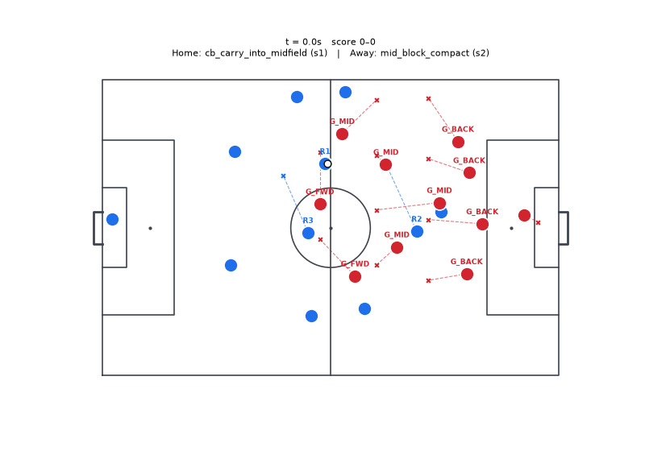

## fullback_outlet_bounce

Against **mid_block**, running `mid_block_compact`. 4-4-2 v 4-4-2, mid progression start. Steps reached: s1 → s2; ended: success.

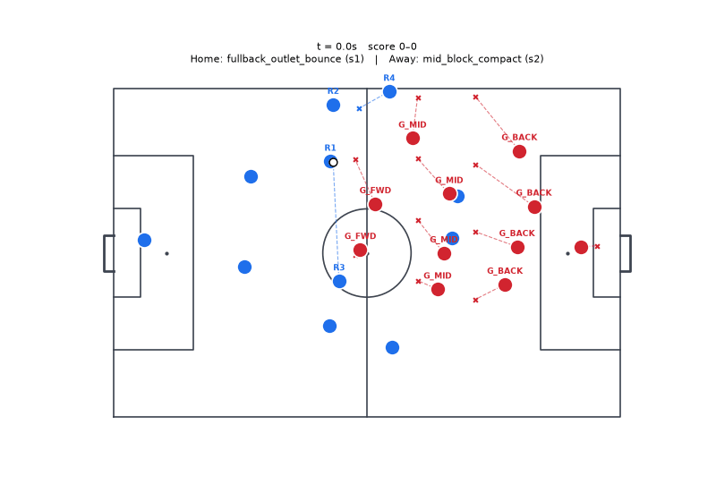

## long_ball_to_target

Against **low_block_counter**, running `low_block_box_protection`, `mid_block_compact`. 4-4-2 v 4-4-2, mid progression start. Steps reached: s1; ended: preempted.

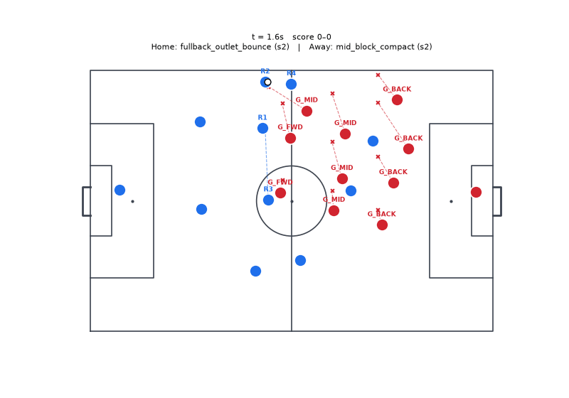

## pivot_drop_back_three

Against **direct**, running `mid_block_compact`. 4-4-2 v 3-5-2, mid progression start. Steps reached: s1 → s2; ended: step timeout abort.

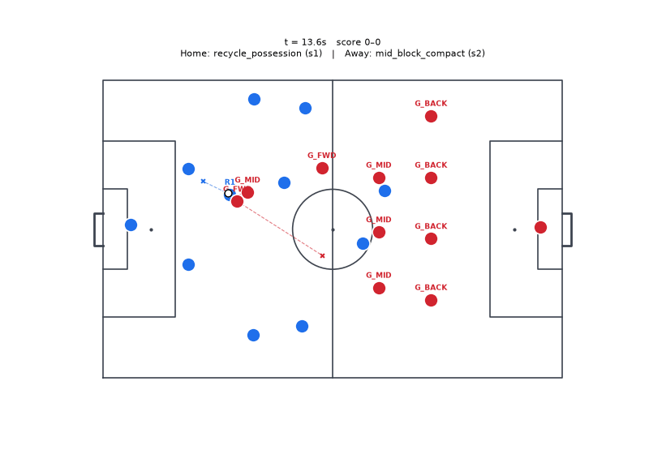

## switch_through_keeper

Against **chaotic**, running `mid_block_compact`. 4-3-3 v 4-4-2, mid progression start. Steps reached: s1; ended: step timeout abort.

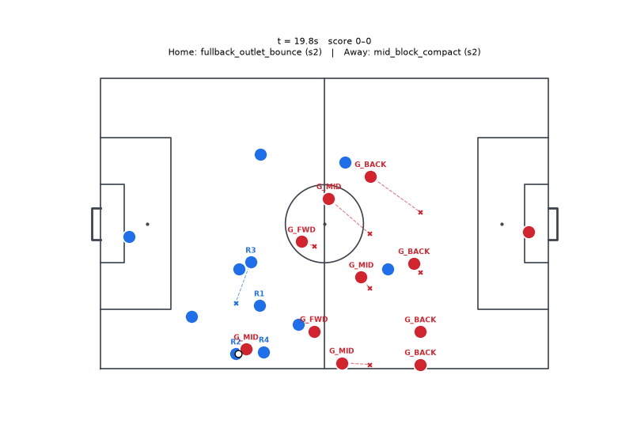

## winger_checks_short

Against **high_press**, running `mid_block_compact`. 4-4-2 v 4-3-3, mid progression start. Steps reached: s1 → s2; ended: success.

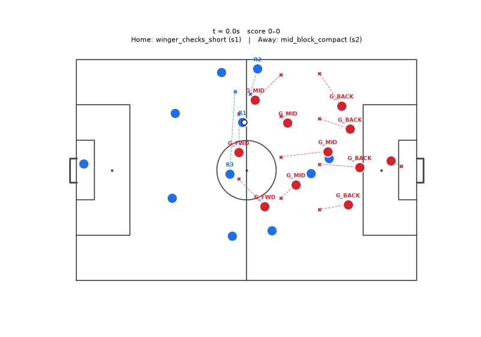

## switch_of_play

Against **mid_block**, running `mid_block_compact`. 4-4-2 v 4-3-3, mid progression start. Steps reached: s1; ended: step timeout abort.

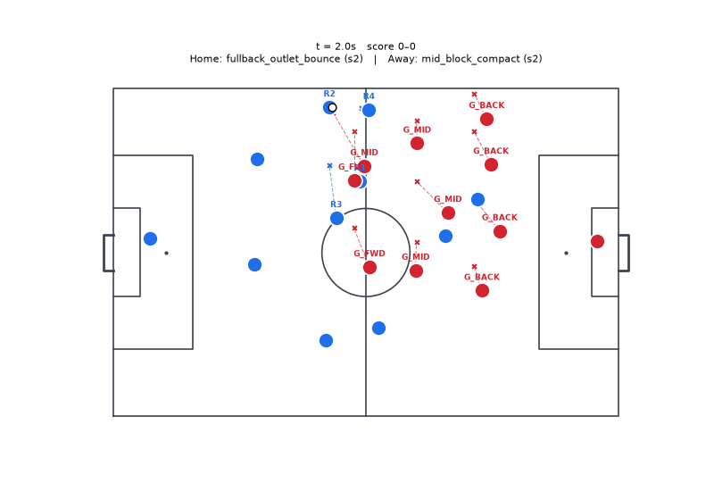

## third_man_combination

Against **low_block_counter**, running `mid_block_compact`. 3-5-2 v 4-4-2, random open play start. Steps reached: s1 → s2 → s3; ended: abort.

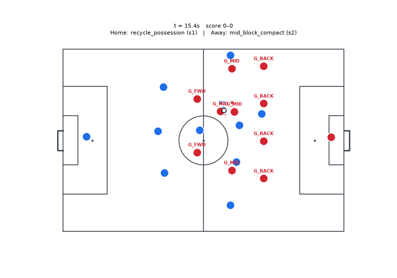

## wide_overlap_cross

Against **direct**, running `low_block_box_protection`, `mid_block_compact`. 3-5-2 v 4-4-2, mid progression start. Steps reached: s1 → s2 → s3 → s4; ended: step timeout abort.

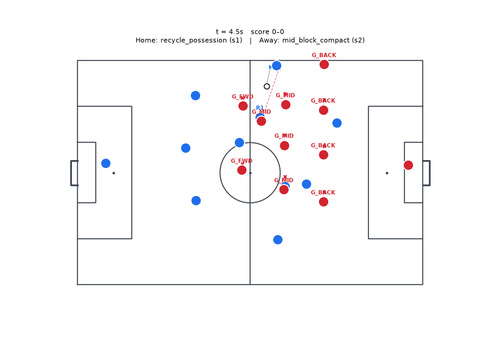

## through_ball_behind_high_line

Against **chaotic**, running `mid_block_compact`. 4-4-2 v 4-4-2, transition win start. Steps reached: s1 → s2; ended: step timeout abort.

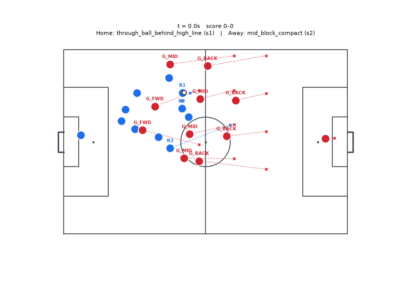

## direct_counterattack

Against **high_press**, running `mid_block_compact`. 4-4-2 v 4-3-3, transition win start. Steps reached: s1 → s1b → s2 → s3; ended: abort.

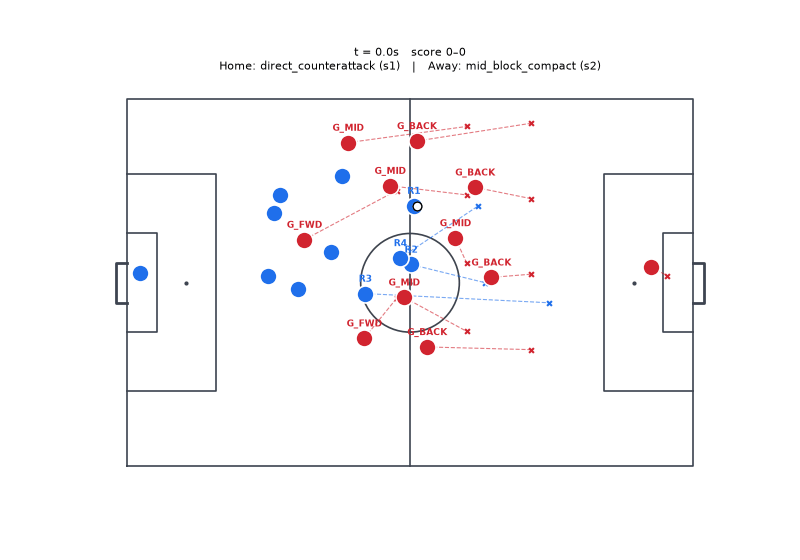

## one_two_wall_pass

Against **mid_block**, running `low_block_box_protection`. 3-5-2 v 4-4-2, random open play start. Steps reached: s1 → s2 → s3; ended: preempted.

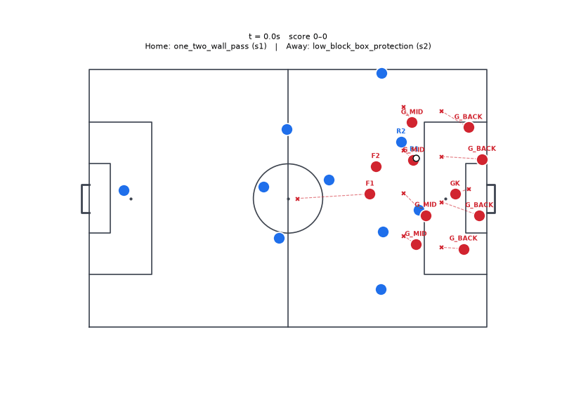
