# Generated plays that worked · run 3

259 times a generated play succeeded in this run (141 different plays), during league training or the final evaluation. A generated play counts as successful when it reached its own success condition or gained at least 0.005 EPV. Below, the best instance of each play (by reward), with what the opponent was running and the play's full definition.

`generated_successes.html` has every clip with the decision inspector; download it and open it in a browser.

| Play | By | Against | Opponent's play | Why it counts | Reward | Stage |
|---|---|---|---|---|---|---|
| [`gen_8706264fbc`](#gen_8706264fbc) | main | wing_play | `low_block_box_protection` | gained at least 0.005 EPV | +0.0868 | evaluation (update 6) |
| [`gen_549faeebd8`](#gen_549faeebd8) | main_exploiter | main | `low_block_box_protection`, `mid_block_compact` | reached its success condition; gained at least 0.005 EPV | +0.0725 | league (update 2) |
| [`gen_07bf4f0488`](#gen_07bf4f0488) | league_exploiter | chaotic | `low_block_box_protection`, `mid_block_compact` | reached its success condition; gained at least 0.005 EPV | +0.0657 | league (update 3) |
| [`gen_e55b04e172`](#gen_e55b04e172) | main_exploiter | main | `low_block_box_protection` | reached its success condition; gained at least 0.005 EPV | +0.0587 | league (update 0) |
| [`gen_71bed43638`](#gen_71bed43638) | league_exploiter | main@5 | `low_block_box_protection` | gained at least 0.005 EPV | +0.0459 | league (update 5) |
| [`gen_269bcc6fdc`](#gen_269bcc6fdc) | main | direct | `low_block_box_protection` | gained at least 0.005 EPV | +0.0393 | evaluation (update 6) |
| [`gen_d00d49208c`](#gen_d00d49208c) | main | league_exploiter | `low_block_box_protection`, `mid_block_compact` | reached its success condition; gained at least 0.005 EPV | +0.0308 | league (update 2) |
| [`gen_840f343637`](#gen_840f343637) | league_exploiter | chaotic | `low_block_box_protection` | gained at least 0.005 EPV | +0.0307 | league (update 3) |
| [`gen_f6f2f8b8df`](#gen_f6f2f8b8df) | main | mid_block | `low_block_box_protection` | reached its success condition; gained at least 0.005 EPV | +0.0291 | league (update 2) |
| [`gen_8cff46b2f5`](#gen_8cff46b2f5) | main_exploiter | main | `low_block_box_protection` | gained at least 0.005 EPV | +0.0282 | league (update 2) |
| [`gen_07428e0fe9`](#gen_07428e0fe9) | league_exploiter | main@5 | `low_block_box_protection` | gained at least 0.005 EPV | +0.0274 | league (update 5) |
| [`gen_62635e9209`](#gen_62635e9209) | league_exploiter | main | `low_block_box_protection` | reached its success condition; gained at least 0.005 EPV | +0.0273 | league (update 3) |

## gen_8706264fbc

Called by **main** against **wing_play** (running `low_block_box_protection`); steps reached: s1; ended: completed; reward +0.0868.

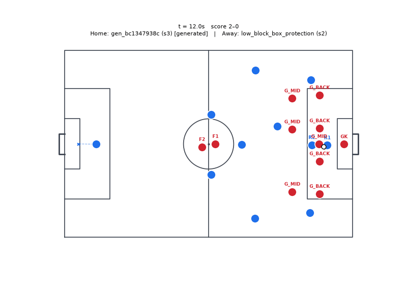

<details><summary>Play definition (YAML)</summary>

```yaml
id: gen_8706264fbc
name: Generated play
version: 1
phase: in_possession
objective: retain_possession
strategy: generated
fallback: false
roles:
- id: R1
  desc: ''
  hints:
  - CB_near
  - CB_far
  - DM
  requires: {}
  prefers: {}
  starts_with_ball: true
triggers:
  all:
  - possession: us
  - has_ball: R1
hard_constraints: []
steps:
- id: s1
  choose:
  - when:
      pressure_on:
        ref: role:R1
        gt: 4.0
    actions:
    - type: carry
      role: R1
      to:
        anchor: ball
        offset:
        - 2.0
        - 0.0
      speed: jog
  - when: always
    actions:
    - type: pass
      role: R1
      to:
        best_teammate:
          score: pass_p
      style: ground
  done_when:
    any:
    - event: pass_completed
    - step_elapsed_s:
        gt: 2.0
  timeout_s: 3.0
  on_timeout: abort
success:
  event: pass_completed
abort:
  event: possession_lost
max_duration_s: 5.0
cooldown_s: 0.0
soft_hints:
  risk: 0.1
  chain_depth: 1
  tempo: slow
source: generated
```

</details>

## gen_549faeebd8

Called by **main_exploiter** against **main** (running `low_block_box_protection`, `mid_block_compact`); steps reached: s1 → s2 → s3 → s4; ended: success; reward +0.0725.

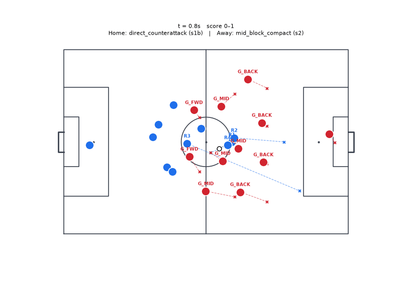

<details><summary>Play definition (YAML)</summary>

```yaml
id: gen_549faeebd8
name: Generated play
version: 1
phase: transition_attack
objective: create_chance
strategy: generated
fallback: false
roles:
- id: R1
  desc: ''
  hints:
  - DM
  - CM
  - CB_near
  requires: {}
  prefers: {}
  starts_with_ball: true
- id: R2
  desc: ''
  hints:
  - ST
  - W_near
  - W_far
  requires:
    pace: 0.6
  prefers: {}
  starts_with_ball: false
- id: R3
  desc: ''
  hints:
  - W_far
  - W_near
  - AM
  requires:
    pace: 0.5
  prefers: {}
  starts_with_ball: false
- id: R4
  desc: ''
  hints:
  - AM
  - CM
  requires: {}
  prefers: {}
  starts_with_ball: false
triggers:
  all:
  - possession: us
  - has_ball: R1
  - event:
      type: possession_won
      within_s: 2.0
hard_constraints: []
steps:
- id: s1
  actions:
  - type: spin_in_behind
    role: R2
    line: opp_last_line
    lane: center
    depth: 8.0
  - type: run_to
    role: R3
    to:
      anchor: ball
      offset:
      - 24.0
      - -18.0
    speed: max
  - type: run_to
    role: R4
    to:
      anchor: ball
      offset:
      - 12.0
      - 0.0
    speed: fast
  done_when:
    step_elapsed_s:
      gt: 0.3
  timeout_s: 0.5
  on_timeout: abort
- id: s2
  choose:
  - when:
      lane_open:
        from: R1
        to:
          space_behind:
            line: opp_last_line
            lane: center
            depth: 8.0
        min_p: 0.45
    actions:
    - type: pass
      role: R1
      to:
        space_behind:
          line: opp_last_line
          lane: center
          depth: 8.0
      style: through
  - when:
      lane_open:
        from: R1
        to:
          role: R4
        min_p: 0.75
    actions:
    - type: pass
      role: R1
      to:
        role: R4
      style: driven
  - when: always
    actions:
    - type: carry
      role: R1
      to:
        anchor: ball
        offset:
        - 16.0
        - -10.0
      speed: fast
  done_when:
    any:
    - has_ball: R4
    - step_elapsed_s:
        gt: 2.0
  timeout_s: 3.0
  on_timeout: abort
- id: s3
  choose:
  - when:
      has_ball: R4
    actions:
    - type: pass
      role: R4
      to:
        best_teammate:
          score: pc_xt
      style: through
  - when: always
    actions:
    - type: carry
      actor: ball_holder
      to:
        anchor: penalty_spot
        offset:
        - 0.0
        - 0.0
      speed: max
  done_when:
    any:
    - ball_in_zone: box
    - event: pass_completed
    - pressure_on:
        ref: ball_holder
        lt: 2.0
  timeout_s: 5.0
  on_timeout: abort
- id: s4
  choose:
  - when:
      xg:
        ref: ball_holder
        gt: 0.08
    actions:
    - type: shoot
      actor: ball_holder
      placement: auto
  - when: always
    actions:
    - type: pass
      actor: ball_holder
      to:
        best_teammate:
          score: xt
          zone: box
      style: ground
  done_when:
    any:
    - event: shot_taken
    - event: pass_completed
  timeout_s: 3.0
  on_timeout: abort
success:
  event: shot_taken
abort:
  event: possession_lost
max_duration_s: 13.5
cooldown_s: 0.0
soft_hints:
  risk: 0.5
  chain_depth: 4
  tempo: fast
source: generated
```

</details>

## gen_07bf4f0488

Called by **league_exploiter** against **chaotic** (running `low_block_box_protection`, `mid_block_compact`); steps reached: s1 → s2 → s3 → s4 → s5; ended: success; reward +0.0657.

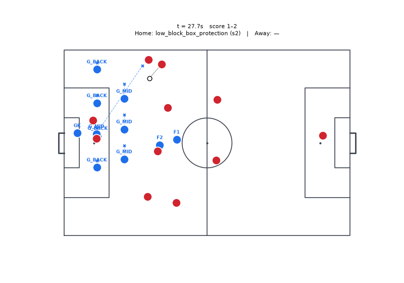

<details><summary>Play definition (YAML)</summary>

```yaml
id: gen_07bf4f0488
name: Generated play
version: 1
phase: in_possession
objective: create_chance
strategy: generated
fallback: false
roles:
- id: R1
  desc: ''
  hints:
  - W_near
  - FB_near
  requires:
    dribbling: 0.4
    passing: 0.4
  prefers: {}
  starts_with_ball: true
- id: R2
  desc: ''
  hints:
  - FB_near
  requires:
    pace: 0.5
    stamina: 0.4
  prefers: {}
  starts_with_ball: false
- id: R3
  desc: ''
  hints:
  - ST
  requires: {}
  prefers: {}
  starts_with_ball: false
- id: R4
  desc: ''
  hints:
  - W_far
  - AM
  requires: {}
  prefers: {}
  starts_with_ball: false
- id: R5
  desc: ''
  hints:
  - AM
  - CM
  requires: {}
  prefers: {}
  starts_with_ball: false
triggers:
  all:
  - possession: us
  - has_ball: R1
hard_constraints: []
steps:
- id: s1
  actions:
  - type: carry
    role: R1
    to:
      anchor: ball
      offset:
      - 4.0
      - -4.0
    speed: jog
  - type: overlap
    role: R2
    around: R1
  - type: run_to
    role: R3
    to:
      zone: final_third.center
    speed: fast
  - type: run_to
    role: R4
    to:
      zone: final_third.far_halfspace
    speed: fast
  done_when:
    all:
    - ahead_of:
        a: role:R2
        b: role:R1
        by: 3.0
    - lane_open:
        from: R1
        to:
          role: R2
          lead: 4.0
        min_p: 0.65
  timeout_s: 5.0
  on_timeout: abort
- id: s2
  actions:
  - type: pass
    role: R1
    to:
      role: R2
      lead: 4.0
    style: ground
  done_when:
    has_ball: R2
  timeout_s: 3.0
  on_timeout: abort
- id: s3
  actions:
  - type: carry
    role: R2
    to:
      anchor: byline_near
      offset:
      - -4.0
      - -4.0
    speed: fast
  - type: run_to
    role: R3
    to:
      zone: near_post_area
    speed: max
    arrive_with: R2
  - type: run_to
    role: R4
    to:
      zone: far_post_area
    speed: fast
    arrive_with: R2
  - type: run_to
    role: R5
    to:
      zone: cutback_zone
    speed: fast
  done_when:
    any:
    - dist:
        a: role:R2
        b: anchor:byline_near
        lt: 8.0
    - pressure_on:
        ref: role:R2
        lt: 2.0
  timeout_s: 4.0
  on_timeout: abort
- id: s4
  choose:
  - when:
      pc_at:
        target:
          zone: cutback_zone
        gt: 0.6
    actions:
    - type: cutback
      actor: ball_holder
      to:
        role: R5
  - when:
      pc_at:
        target:
          zone: near_post_area
        gt: 0.5
    actions:
    - type: cross
      role: R2
      to:
        role: R3
      style: driven_low
  - when: always
    actions:
    - type: cross
      role: R2
      to:
        role: R4
      style: lofted
  done_when:
    any:
    - event: pass_completed
    - event: pass_intercepted
    - event: ball_out
  timeout_s: 3.0
  on_timeout: abort
- id: s5
  choose:
  - when:
      xg:
        ref: ball_holder
        gt: 0.06
    actions:
    - type: shoot
      actor: ball_holder
      placement: auto
  - when: always
    actions:
    - type: cross
      actor: ball_holder
      to:
        role: R3
      style: driven_low
  done_when:
    any:
    - event: possession_lost
    - event: shot_taken
    - event: pass_completed
  timeout_s: 2.0
  on_timeout: abort
success:
  any:
  - event: shot_taken
  - event: goal
abort:
  any:
  - event: possession_lost
  - event: ball_out
max_duration_s: 19.0
cooldown_s: 0.0
soft_hints:
  risk: 0.4
  chain_depth: 5
  tempo: medium
source: generated
```

</details>

## gen_e55b04e172

Called by **main_exploiter** against **main** (running `low_block_box_protection`); steps reached: s1 → s2 → s3 → s4 → s5; ended: success; reward +0.0587.

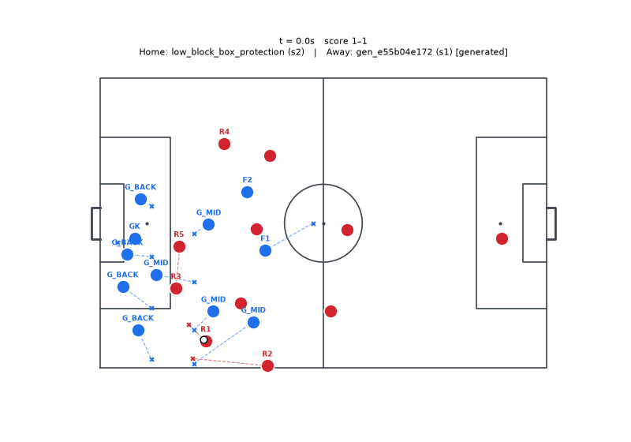

<details><summary>Play definition (YAML)</summary>

```yaml
id: gen_e55b04e172
name: Generated play
version: 1
phase: in_possession
objective: create_chance
strategy: generated
fallback: false
roles:
- id: R1
  desc: ''
  hints:
  - W_near
  - FB_near
  requires:
    dribbling: 0.4
    passing: 0.4
  prefers: {}
  starts_with_ball: true
- id: R2
  desc: ''
  hints:
  - FB_near
  requires:
    pace: 0.5
    stamina: 0.4
  prefers: {}
  starts_with_ball: false
- id: R3
  desc: ''
  hints:
  - ST
  requires: {}
  prefers: {}
  starts_with_ball: false
- id: R4
  desc: ''
  hints:
  - W_far
  - AM
  requires: {}
  prefers: {}
  starts_with_ball: false
- id: R5
  desc: ''
  hints:
  - AM
  - CM
  requires: {}
  prefers: {}
  starts_with_ball: false
triggers:
  all:
  - possession: us
  - has_ball: R1
hard_constraints: []
steps:
- id: s1
  actions:
  - type: carry
    role: R1
    to:
      anchor: ball
      offset:
      - 4.0
      - -4.0
    speed: jog
  - type: overlap
    role: R2
    around: R1
  - type: run_to
    role: R3
    to:
      zone: final_third.center
    speed: fast
  - type: run_to
    role: R4
    to:
      zone: final_third.far_halfspace
    speed: fast
  done_when:
    all:
    - ahead_of:
        a: role:R2
        b: role:R1
        by: 3.0
    - lane_open:
        from: R1
        to:
          role: R2
          lead: 4.0
        min_p: 0.65
  timeout_s: 5.0
  on_timeout: abort
- id: s2
  actions:
  - type: pass
    role: R1
    to:
      role: R2
      lead: 4.0
    style: ground
  done_when:
    has_ball: R2
  timeout_s: 3.0
  on_timeout: abort
- id: s3
  actions:
  - type: carry
    role: R2
    to:
      anchor: byline_near
      offset:
      - -4.0
      - -4.0
    speed: fast
  - type: run_to
    role: R3
    to:
      zone: near_post_area
    speed: max
    arrive_with: R2
  - type: run_to
    role: R4
    to:
      zone: far_post_area
    speed: fast
    arrive_with: R2
  - type: run_to
    role: R5
    to:
      zone: cutback_zone
    speed: fast
  done_when:
    any:
    - dist:
        a: role:R2
        b: anchor:byline_near
        lt: 8.0
    - pressure_on:
        ref: role:R2
        lt: 2.0
  timeout_s: 4.0
  on_timeout: abort
- id: s4
  choose:
  - when:
      pc_at:
        target:
          zone: cutback_zone
        gt: 0.6
    actions:
    - type: cutback
      role: R2
      to:
        role: R5
  - when:
      pc_at:
        target:
          zone: near_post_area
        gt: 0.5
    actions:
    - type: cross
      role: R2
      to:
        role: R3
      style: driven_low
  - when: always
    actions:
    - type: cross
      role: R2
      to:
        role: R4
      style: lofted
  done_when:
    any:
    - event: pass_completed
    - event: pass_intercepted
    - event: ball_out
  timeout_s: 3.0
  on_timeout: abort
- id: s5
  choose:
  - when:
      xg:
        ref: ball_holder
        gt: 0.06
    actions:
    - type: shoot
      actor: ball_holder
      placement: auto
  - when: always
    actions:
    - type: pass
      actor: ball_holder
      to:
        best_teammate:
          score: xt
          zone: box
      style: ground
      one_touch: true
  done_when:
    any:
    - event: shot_taken
    - event: pass_completed
  timeout_s: 2.0
  on_timeout: abort
success:
  any:
  - event: shot_taken
  - event: goal
abort:
  any:
  - event: possession_lost
  - event: ball_out
max_duration_s: 19.0
cooldown_s: 0.0
soft_hints:
  risk: 0.4
  chain_depth: 5
  tempo: medium
source: generated
```

</details>

## gen_71bed43638

Called by **league_exploiter** against **main@5** (running `low_block_box_protection`); steps reached: s1 → s2 → s3; ended: step timeout abort; reward +0.0459.

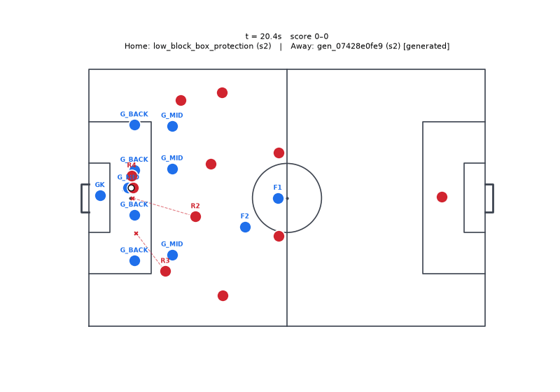

<details><summary>Play definition (YAML)</summary>

```yaml
id: gen_71bed43638
name: Generated play
version: 1
phase: in_possession
objective: create_chance
strategy: generated
fallback: false
roles:
- id: R1
  desc: ''
  hints:
  - AM
  - W_near
  - CM
  requires:
    passing: 0.4
  prefers: {}
  starts_with_ball: true
- id: R2
  desc: ''
  hints:
  - ST
  - AM
  - CM
  requires:
    first_touch: 0.5
  prefers: {}
  starts_with_ball: false
triggers:
  all:
  - possession: us
  - has_ball: R1
hard_constraints: []
steps:
- id: s1
  actions:
  - type: pass
    role: R1
    to:
      role: R2
    style: ground
  done_when:
    event: pass_completed
  timeout_s: 2.0
  on_timeout: abort
- id: s2
  actions:
  - type: run_to
    role: R1
    to:
      anchor: role:R1
      offset:
      - 8.0
      - 0.0
      freeze: step_start
    speed: max
  done_when:
    lane_open:
      from: R2
      to:
        role: R1
        lead: 3.0
      min_p: 0.6
  timeout_s: 1.5
  on_timeout: abort
- id: s3
  actions:
  - type: pass
    role: R2
    to:
      role: R1
      lead: 3.0
    style: ground
    one_touch: true
  done_when:
    has_ball: R1
  timeout_s: 2.0
  on_timeout: abort
- id: s4
  choose:
  - when:
      pc_at:
        target:
          zone: near_post_area
        gt: 0.5
    actions:
    - type: dribble
      role: R1
      to:
        anchor: ball
        offset:
        - 4.0
        - 0.0
    - type: carry
      role: R1
      to:
        anchor: ball
        offset:
        - 2.0
        - 0.0
      speed: jog
  - when:
      lane_open:
        from: R1
        to:
          space_behind:
            line: opp_last_line
            lane: center
            depth: 10.0
        min_p: 0.4
    actions:
    - type: carry
      role: R1
      to:
        anchor: ball
        offset:
        - 8.0
        - 0.0
      speed: jog
  - when: always
    actions:
    - type: carry
      role: R1
      to:
        anchor: ball
        offset:
        - 12.0
        - 0.0
      speed: jog
  done_when:
    any:
    - dist:
        a: role:R2
        b: anchor:byline_near
        lt: 8.0
    - pressure_on:
        ref: ball_holder
        lt: 2.0
  timeout_s: 3.0
  on_timeout: abort
success:
  event: shot_taken
abort:
  event: possession_lost
max_duration_s: 10.5
cooldown_s: 0.0
soft_hints:
  risk: 0.3
  chain_depth: 4
  tempo: fast
source: generated
```

</details>

## gen_269bcc6fdc

Called by **main** against **direct** (running `low_block_box_protection`); steps reached: s1; ended: abort; reward +0.0393.

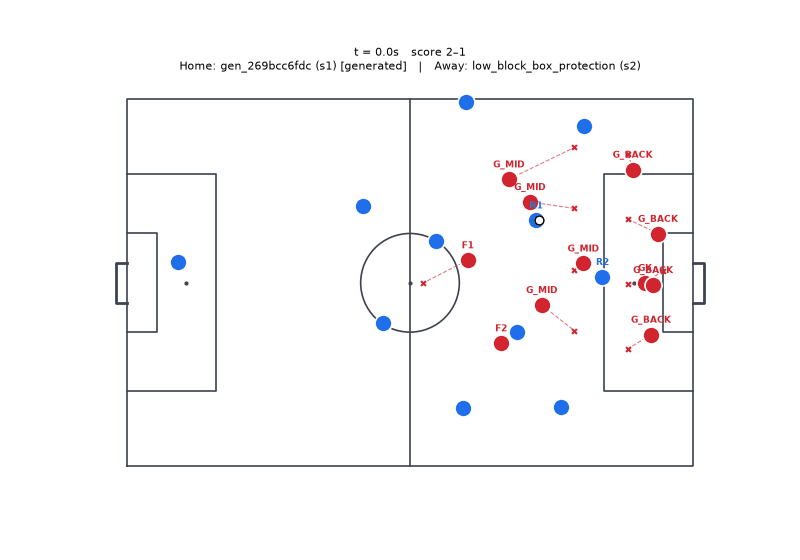

<details><summary>Play definition (YAML)</summary>

```yaml
id: gen_269bcc6fdc
name: Generated play
version: 1
phase: in_possession
objective: create_chance
strategy: generated
fallback: false
roles:
- id: R1
  desc: ''
  hints:
  - AM
  - W_near
  - CM
  requires:
    passing: 0.4
  prefers: {}
  starts_with_ball: true
- id: R2
  desc: ''
  hints:
  - ST
  - AM
  - CM
  requires:
    first_touch: 0.5
  prefers: {}
  starts_with_ball: false
triggers:
  all:
  - possession: us
  - has_ball: R1
hard_constraints: []
steps:
- id: s1
  actions:
  - type: pass
    role: R1
    to:
      role: R2
    style: ground
  done_when:
    event: pass_completed
  timeout_s: 2.0
  on_timeout: abort
- id: s2
  actions:
  - type: run_to
    role: R1
    to:
      anchor: role:R1
      offset:
      - 8.0
      - 0.0
      freeze: step_start
    speed: max
  done_when:
    lane_open:
      from: R2
      to:
        role: R1
        lead: 3.0
      min_p: 0.6
  timeout_s: 1.5
  on_timeout: abort
- id: s3
  actions:
  - type: pass
    role: R2
    to:
      role: R1
      lead: 3.0
    style: ground
    one_touch: true
  done_when:
    has_ball: R1
  timeout_s: 2.0
  on_timeout: abort
- id: s4
  choose:
  - when:
      xg:
        ref: role:R1
        gt: 0.08
    actions:
    - type: shoot
      role: R1
      placement: auto
  - when: always
    actions:
    - type: carry
      role: R1
      to:
        pc_best:
          zone: box
        score: pc_xt
      speed: fast
  done_when:
    any:
    - has_ball: R1
    - ball_beyond_line:
        line: opp_first_line
  timeout_s: 3.0
  on_timeout: abort
- id: s5
  choose:
  - when:
      pc_at:
        target:
          zone: near_post_area
        gt: 0.5
    actions:
    - type: carry
      role: R1
      to:
        anchor: ball
        offset:
        - 4.0
        - 0.0
      speed: jog
  - when: always
    actions:
    - type: carry
      role: R1
      to:
        anchor: ball
        offset:
        - 8.0
        - 0.0
      speed: jog
  done_when:
    any:
    - dist:
        a: role:R2
        b: anchor:byline_near
        lt: 8.0
    - pressure_on:
        ref: role:R2
        lt: 2.0
  timeout_s: 3.0
  on_timeout: abort
success:
  any:
  - event: pass_completed
  - ball_in_zone: box
abort:
  any:
  - event: pass_completed
  - pressure_on:
      ref: role:R2
      lt: 2.0
max_duration_s: 13.5
cooldown_s: 0.0
soft_hints:
  risk: 0.3
  chain_depth: 5
  tempo: fast
source: generated
```

</details>

## gen_d00d49208c

Called by **main** against **league_exploiter** (running `low_block_box_protection`, `mid_block_compact`); steps reached: s1; ended: success; reward +0.0308.

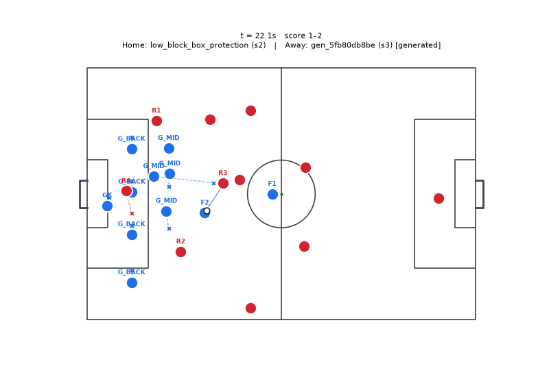

<details><summary>Play definition (YAML)</summary>

```yaml
id: gen_d00d49208c
name: Generated play
version: 1
phase: in_possession
objective: create_chance
strategy: generated
fallback: false
roles:
- id: R1
  desc: ''
  hints:
  - AM
  - W_near
  - CM
  requires:
    passing: 0.4
  prefers: {}
  starts_with_ball: true
- id: R2
  desc: ''
  hints:
  - ST
  - AM
  - CM
  requires:
    first_touch: 0.5
  prefers: {}
  starts_with_ball: false
triggers:
  all:
  - possession: us
  - has_ball: R1
hard_constraints: []
steps:
- id: s1
  actions:
  - type: pass
    role: R1
    to:
      role: R2
    style: ground
  done_when:
    event: pass_completed
  timeout_s: 2.0
  on_timeout: abort
- id: s2
  actions:
  - type: run_to
    role: R1
    to:
      anchor: role:R1
      offset:
      - 8.0
      - 0.0
    speed: max
  done_when:
    lane_open:
      from: R2
      to:
        role: R1
        lead: 3.0
      min_p: 0.6
  timeout_s: 1.5
  on_timeout: abort
- id: s3
  actions:
  - type: pass
    role: R2
    to:
      role: R1
      lead: 3.0
    style: ground
    one_touch: true
  done_when:
    has_ball: R1
  timeout_s: 2.0
  on_timeout: abort
- id: s4
  choose:
  - when:
      xg:
        ref: role:R1
        gt: 0.08
    actions:
    - type: shoot
      role: R1
      placement: auto
  - when: always
    actions:
    - type: carry
      role: R1
      to:
        pc_best:
          zone: box
        score: pc_xt
      speed: fast
  done_when:
    any:
    - event: shot_taken
    - ball_in_zone: box
  timeout_s: 3.0
  on_timeout: abort
- id: s5
  choose:
  - when:
      xg:
        ref: role:R1
        gt: 0.08
    actions:
    - type: carry
      role: R1
      to:
        anchor: ball
        offset:
        - 8.0
        - 0.0
      speed: jog
    - type: carry
      role: R1
      to:
        anchor: ball
        offset:
        - 12.0
        - 0.0
      speed: jog
  - when: always
    actions:
    - type: pass
      role: R1
      to:
        role: R1
        lead: 3.0
      style: ground
  done_when:
    any:
    - has_ball: R1
    - ball_beyond_line:
        line: opp_first_line
  timeout_s: 3.0
  on_timeout: abort
success:
  ball_in_zone: box
abort:
  any:
  - pressure_on:
      ref: role:R2
      lt: 2.0
max_duration_s: 13.5
cooldown_s: 0.0
soft_hints:
  risk: 0.3
  chain_depth: 5
  tempo: fast
source: generated
```

</details>

## gen_840f343637

Called by **league_exploiter** against **chaotic** (running `low_block_box_protection`); steps reached: s1; ended: preempted; reward +0.0307.

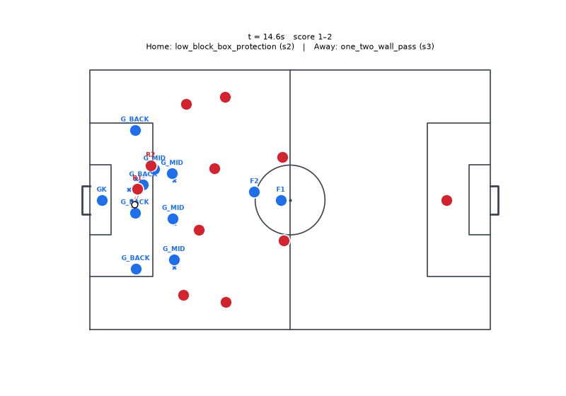

<details><summary>Play definition (YAML)</summary>

```yaml
id: gen_840f343637
name: Generated play
version: 1
phase: in_possession
objective: create_chance
strategy: generated
fallback: false
roles:
- id: R1
  desc: ''
  hints:
  - DM
  requires: {}
  prefers: {}
  starts_with_ball: true
- id: R2
  desc: ''
  hints:
  - AM
  - CM
  requires:
    passing: 0.5
  prefers: {}
  starts_with_ball: false
- id: R3
  desc: ''
  hints:
  - AM
  - CM
  requires:
    pace: 0.5
  prefers: {}
  starts_with_ball: false
- id: R4
  desc: ''
  hints:
  - W_far
  - AM
  - CM
  requires: {}
  prefers: {}
  starts_with_ball: false
triggers:
  all:
  - possession: us
  - has_ball: R1
hard_constraints: []
steps:
- id: s1
  actions:
  - type: hold_width
    role: R3
    lane: far_wing
  - type: support
    role: R3
    from: R2
    angle: square
    distance: 12.0
  - type: check_to_ball
    role: R2
    distance: 3.0
    duration_s: 0.8
  - type: support
    role: R3
    from: R2
    angle: square
    distance: 12.0
  done_when:
    step_elapsed_s:
      gt: 1.0
  timeout_s: 2.0
  on_timeout: abort
- id: s2
  actions:
  - type: spin_in_behind
    role: R4
    line: opp_last_line
    lane: center
    depth: 10.0
  done_when:
    all:
    - ahead_of:
        a: role:R2
        b: role:R1
        by: 3.0
    - lane_open:
        from: R1
        to:
          role: R2
        min_p: 0.75
    - lane_open:
        from: R1
        to:
          role: R3
        min_p: 0.7
  timeout_s: 3.0
  on_timeout: abort
- id: s3
  choose:
  - when:
      lane_open:
        from: R2
        to:
          role: R4
        min_p: 0.7
    actions:
    - type: carry
      role: R2
      to:
        anchor: ball
        offset:
        - 2.0
        - 0.0
      speed: jog
  - when: always
    actions:
    - type: run_to
      role: R3
      to:
        zone: near_post_area
      speed: max
  done_when:
    any:
    - event: possession_lost
    - event: shot_taken
    - event: shot_taken
  timeout_s: 3.0
  on_timeout: abort
- id: s4
  choose:
  - when:
      pc_at:
        target:
          zone: far_post_area
        gt: 0.65
    actions:
    - type: carry
      role: R1
      to:
        anchor: ball
        offset:
        - 4.0
        - 2.0
      speed: jog
  - when: always
    actions:
    - type: carry
      role: R3
      to:
        anchor: ball
        offset:
        - 2.0
        - 0.0
      speed: max
    - type: pass
      actor: ball_holder
      to:
        best_teammate:
          score: pass_p
      style: through
  done_when:
    any:
    - dist:
        a: role:R2
        b: ball_holder
        lt: 2.0
  timeout_s: 2.5
  on_timeout: abort
success:
  event: shot_taken
abort:
  event: pass_completed
max_duration_s: 12.5
cooldown_s: 0.0
soft_hints:
  risk: 0.3
  chain_depth: 4
  tempo: fast
source: generated
```

</details>

## gen_f6f2f8b8df

Called by **main** against **mid_block** (running `low_block_box_protection`); steps reached: s1; ended: success; reward +0.0291.

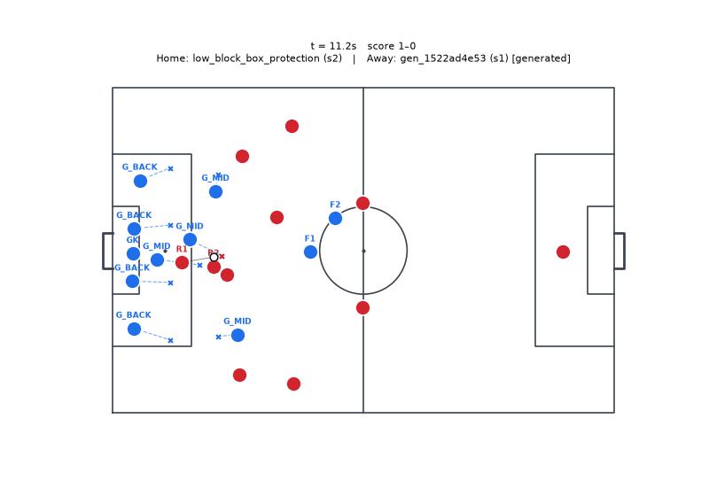

<details><summary>Play definition (YAML)</summary>

```yaml
id: gen_f6f2f8b8df
name: Generated play
version: 1
phase: in_possession
objective: create_chance
strategy: generated
fallback: false
roles:
- id: R1
  desc: ''
  hints:
  - AM
  - W_near
  - CM
  requires:
    passing: 0.4
  prefers: {}
  starts_with_ball: true
- id: R2
  desc: ''
  hints:
  - ST
  - AM
  - CM
  requires:
    first_touch: 0.5
  prefers: {}
  starts_with_ball: false
triggers:
  all:
  - possession: us
  - has_ball: R1
hard_constraints: []
steps:
- id: s1
  actions:
  - type: pass
    role: R1
    to:
      role: R2
    style: ground
  done_when:
    event: pass_completed
  timeout_s: 2.0
  on_timeout: abort
- id: s2
  actions:
  - type: run_to
    role: R1
    to:
      anchor: role:R1
      offset:
      - 8.0
      - 0.0
    speed: max
  - type: pass
    role: R2
    to:
      role: R1
      lead: 3.0
    style: ground
  done_when:
    has_ball: R2
  timeout_s: 2.5
  on_timeout: abort
- id: s3
  actions:
  - type: pass
    role: R2
    to:
      role: R2
    style: ground
  done_when:
    has_ball: R1
  timeout_s: 2.0
  on_timeout: abort
- id: s4
  actions:
  - type: pass
    role: R2
    to:
      role: R1
      lead: 3.0
    style: ground
    one_touch: true
  done_when:
    has_ball: R1
  timeout_s: 2.0
  on_timeout: abort
- id: s5
  choose:
  - when:
      xg:
        ref: role:R1
        gt: 0.08
    actions:
    - type: pass
      role: R2
      to:
        role: R1
        lead: 2.0
      style: ground
  - when:
      xg:
        ref: role:R1
        gt: 0.08
    actions:
    - type: pass
      role: R2
      to:
        role: R1
        lead: 2.0
      style: ground
      one_touch: true
  - when: always
    actions:
    - type: carry
      role: R1
      to:
        anchor: ball
        offset:
        - 8.0
        - 0.0
      speed: max
  done_when:
    any:
    - event: shot_taken
    - ball_in_zone: box
  timeout_s: 3.0
  on_timeout: abort
success:
  any:
  - event: shot_taken
  - ball_in_zone: box
abort:
  any:
  - event: pass_completed
  - step_elapsed_s:
      gt: 2.0
max_duration_s: 13.5
cooldown_s: 0.0
soft_hints:
  risk: 0.3
  chain_depth: 5
  tempo: fast
source: generated
```

</details>

## gen_8cff46b2f5

Called by **main_exploiter** against **main** (running `low_block_box_protection`); steps reached: s1 → s2 → s3 → s4 → s5; ended: step timeout abort; reward +0.0282.

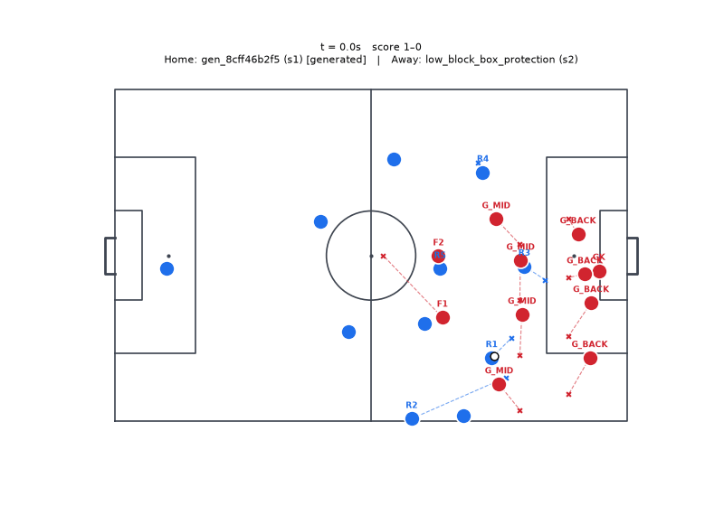

<details><summary>Play definition (YAML)</summary>

```yaml
id: gen_8cff46b2f5
name: Generated play
version: 1
phase: in_possession
objective: create_chance
strategy: generated
fallback: false
roles:
- id: R1
  desc: ''
  hints:
  - W_near
  - FB_near
  requires:
    dribbling: 0.4
    passing: 0.4
  prefers: {}
  starts_with_ball: true
- id: R2
  desc: ''
  hints:
  - FB_near
  requires:
    pace: 0.5
    stamina: 0.4
  prefers: {}
  starts_with_ball: false
- id: R3
  desc: ''
  hints:
  - ST
  requires: {}
  prefers: {}
  starts_with_ball: false
- id: R4
  desc: ''
  hints:
  - W_far
  - AM
  requires: {}
  prefers: {}
  starts_with_ball: false
- id: R5
  desc: ''
  hints:
  - AM
  - CM
  requires: {}
  prefers: {}
  starts_with_ball: false
triggers:
  all:
  - possession: us
  - has_ball: R1
hard_constraints: []
steps:
- id: s1
  actions:
  - type: carry
    role: R1
    to:
      anchor: ball
      offset:
      - 4.0
      - -4.0
    speed: jog
  - type: overlap
    role: R2
    around: R1
  - type: run_to
    role: R3
    to:
      zone: final_third.center
    speed: fast
  - type: run_to
    role: R4
    to:
      zone: final_third.far_halfspace
    speed: fast
  done_when:
    all:
    - ahead_of:
        a: role:R2
        b: role:R1
        by: 3.0
    - lane_open:
        from: R1
        to:
          role: R2
          lead: 4.0
        min_p: 0.65
  timeout_s: 5.0
  on_timeout: abort
- id: s2
  actions:
  - type: pass
    role: R1
    to:
      role: R2
      lead: 4.0
    style: ground
  done_when:
    has_ball: R2
  timeout_s: 3.0
  on_timeout: abort
- id: s3
  actions:
  - type: carry
    role: R2
    to:
      anchor: byline_near
      offset:
      - -4.0
      - -4.0
    speed: fast
  - type: run_to
    role: R3
    to:
      zone: near_post_area
    speed: max
    arrive_with: R2
  - type: run_to
    role: R4
    to:
      zone: far_post_area
    speed: fast
    arrive_with: R2
  - type: run_to
    role: R5
    to:
      zone: final_third.far_halfspace
    speed: fast
  done_when:
    any:
    - dist:
        a: role:R2
        b: anchor:byline_near
        lt: 8.0
    - pressure_on:
        ref: role:R2
        lt: 2.0
  timeout_s: 4.0
  on_timeout: abort
- id: s4
  choose:
  - when:
      pc_at:
        target:
          zone: cutback_zone
        gt: 0.6
    actions:
    - type: cutback
      role: R2
      to:
        role: R5
  - when:
      pc_at:
        target:
          zone: near_post_area
        gt: 0.5
    actions:
    - type: cross
      role: R2
      to:
        role: R3
      style: driven_low
  - when: always
    actions:
    - type: cross
      role: R2
      to:
        role: R4
      style: lofted
  done_when:
    any:
    - event: pass_completed
    - event: pass_intercepted
    - event: ball_out
  timeout_s: 3.0
  on_timeout: abort
- id: s5
  choose:
  - when:
      xg:
        ref: ball_holder
        gt: 0.06
    actions:
    - type: shoot
      actor: ball_holder
      placement: auto
  - when: always
    actions:
    - type: pass
      actor: ball_holder
      to:
        best_teammate:
          score: xt
          zone: box
      style: ground
      one_touch: true
  done_when:
    any:
    - event: shot_taken
    - event: pass_completed
  timeout_s: 2.0
  on_timeout: abort
success:
  any:
  - event: shot_taken
  - event: goal
abort:
  any:
  - event: possession_lost
  - event: ball_out
max_duration_s: 19.0
cooldown_s: 0.0
soft_hints:
  risk: 0.4
  chain_depth: 5
  tempo: medium
source: generated
```

</details>

## gen_07428e0fe9

Called by **league_exploiter** against **main@5** (running `low_block_box_protection`); steps reached: s1 → s2; ended: step timeout abort; reward +0.0274.

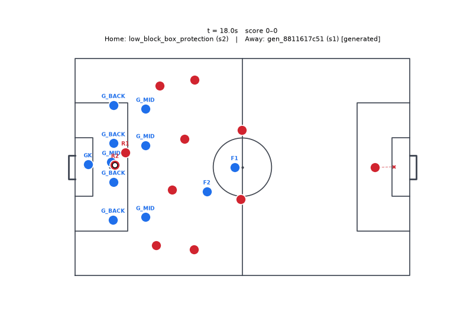

<details><summary>Play definition (YAML)</summary>

```yaml
id: gen_07428e0fe9
name: Generated play
version: 1
phase: in_possession
objective: create_chance
strategy: generated
fallback: false
roles:
- id: R1
  desc: ''
  hints:
  - CB_far
  - DM
  - FB_near
  requires:
    passing: 0.5
  prefers: {}
  starts_with_ball: true
- id: R2
  desc: ''
  hints:
  - CM
  requires:
    passing: 0.5
  prefers: {}
  starts_with_ball: false
- id: R3
  desc: ''
  hints:
  - W_far
  - W_near
  requires: {}
  prefers: {}
  starts_with_ball: false
- id: R4
  desc: ''
  hints:
  - AM
  - CM
  requires: {}
  prefers: {}
  starts_with_ball: false
triggers:
  all:
  - possession: us
  - has_ball: R1
hard_constraints: []
steps:
- id: s1
  actions:
  - type: check_to_ball
    role: R2
    distance: 3.0
    duration_s: 0.8
  - type: decoy_run
    role: R3
    to:
      anchor: line:opp_last_line
      offset:
      - -2.0
      - -12.0
  - type: carry
    role: R1
    to:
      anchor: ball
      offset:
      - 4.0
      - 0.0
    speed: jog
  done_when:
    step_elapsed_s:
      gt: 0.8
  timeout_s: 1.5
  on_timeout: abort
- id: s2
  actions:
  - type: spin_in_behind
    role: R2
    line: opp_last_line
    lane: center
    depth: 10.0
  done_when:
    all:
    - onside: R2
    - lane_open:
        from: R1
        to:
          space_behind:
            line: opp_last_line
            lane: center
            depth: 10.0
        min_p: 0.4
  timeout_s: 1.5
  on_timeout: abort
- id: s3
  actions:
  - type: pass
    role: R1
    to:
      space_behind:
        line: opp_last_line
        lane: center
        depth: 10.0
    style: through
  done_when:
    has_ball: R2
  timeout_s: 3.0
  on_timeout: abort
- id: s4
  actions:
  - type: carry
    role: R2
    to:
      anchor: ball
      offset:
      - 2.0
      - 0.0
    speed: max
  done_when:
    all:
    - possession: us
    - ball_beyond_line:
        line: opp_first_line
    - step_elapsed_s:
        gt: 1.0
  timeout_s: 1.5
  on_timeout: abort
- id: s5
  choose:
  - when:
      lane_open:
        from: R2
        to:
          role: R4
        min_p: 0.65
    actions:
    - type: pass
      role: R2
      to:
        role: R3
      style: ground
      one_touch: true
  - when: always
    actions:
    - type: carry
      role: R2
      to:
        anchor: ball
        offset:
        - 4.0
        - 0.0
      speed: max
    - type: carry
      role: R3
      to:
        pc_best:
          zone: final_third.far_wing
        score: pc_xt
      speed: fast
    - type: overlap
      role: R4
      around: R3
  done_when:
    dist:
      a: role:R2
      b: ball_holder
      lt: 2.0
  timeout_s: 2.5
  on_timeout: abort
success:
  event: shot_taken
abort:
  any:
  - event: ball_out
max_duration_s: 12.0
cooldown_s: 0.0
soft_hints:
  risk: 0.3
  chain_depth: 5
  tempo: fast
source: generated
```

</details>

## gen_62635e9209

Called by **league_exploiter** against **main** (running `low_block_box_protection`); steps reached: s1; ended: success; reward +0.0273.

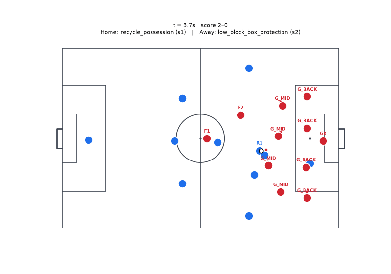

<details><summary>Play definition (YAML)</summary>

```yaml
id: gen_62635e9209
name: Generated play
version: 1
phase: in_possession
objective: create_chance
strategy: generated
fallback: false
roles:
- id: R1
  desc: ''
  hints:
  - AM
  - W_near
  - CM
  requires:
    passing: 0.4
  prefers: {}
  starts_with_ball: true
- id: R2
  desc: ''
  hints:
  - ST
  - AM
  - CM
  requires:
    first_touch: 0.5
  prefers: {}
  starts_with_ball: false
triggers:
  all:
  - possession: us
  - has_ball: R1
hard_constraints: []
steps:
- id: s1
  actions:
  - type: pass
    role: R1
    to:
      role: R2
    style: ground
  done_when:
    event: pass_completed
  timeout_s: 2.0
  on_timeout: abort
- id: s2
  actions:
  - type: run_to
    role: R1
    to:
      anchor: role:R1
      offset:
      - 8.0
      - 0.0
      freeze: step_start
    speed: max
  done_when:
    lane_open:
      from: R2
      to:
        role: R1
        lead: 3.0
      min_p: 0.6
  timeout_s: 1.5
  on_timeout: abort
- id: s3
  actions:
  - type: pass
    role: R2
    to:
      role: R1
      lead: 3.0
    style: ground
    one_touch: true
  done_when:
    has_ball: R1
  timeout_s: 2.0
  on_timeout: abort
- id: s4
  choose:
  - when:
      pc_at:
        target:
          zone: near_post_area
        gt: 0.5
    actions:
    - type: carry
      role: R1
      to:
        anchor: ball
        offset:
        - 4.0
        - 0.0
      speed: jog
  - when: always
    actions:
    - type: carry
      role: R1
      to:
        anchor: ball
        offset:
        - 8.0
        - 0.0
      speed: jog
  done_when:
    any:
    - dist:
        a: role:R2
        b: anchor:byline_near
        lt: 8.0
    - pressure_on:
        ref: role:R2
        lt: 2.0
  timeout_s: 3.0
  on_timeout: abort
success:
  any:
  - event: pass_completed
  - ball_in_zone: box
abort:
  event: possession_lost
max_duration_s: 10.5
cooldown_s: 0.0
soft_hints:
  risk: 0.3
  chain_depth: 4
  tempo: fast
source: generated
```

</details>
