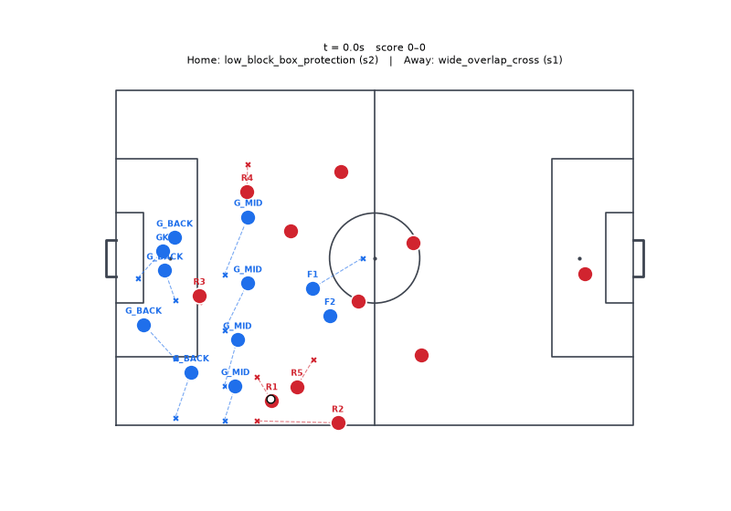
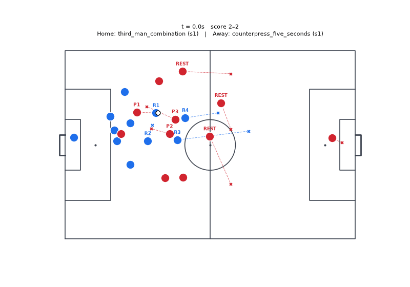
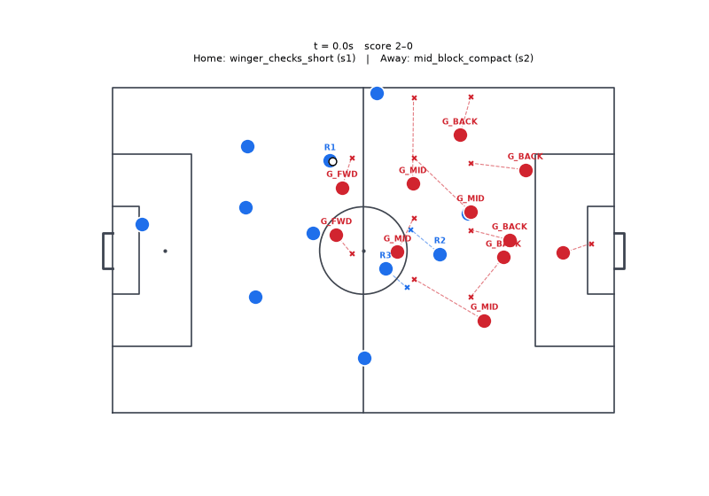
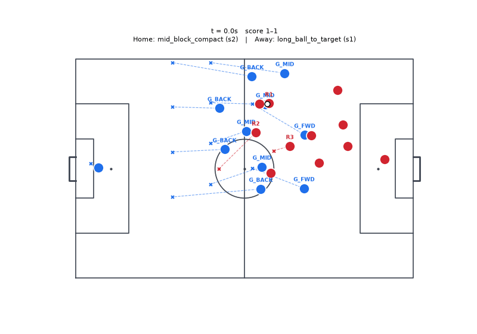
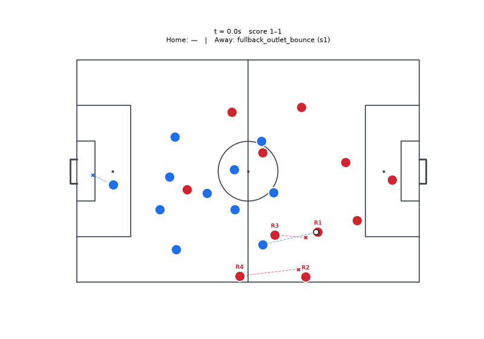
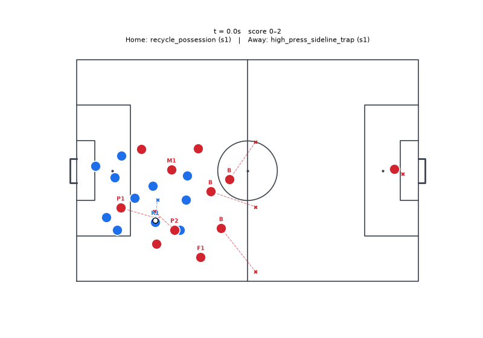

# Pool v2 training games

27 training games had their full tracking saved; 6 are shown here as GIFs (blue = home, red = away; labels are each team's role bindings for the play it is running, dashed lines where players are heading). `training_games.html` has all of them with the decision inspector; download it and open it in a browser.

## Game 0 · high_press (4-4-2) v direct (4-3-3) · random open play · ended: possession change

## Game 2,000 · low_block_counter (3-5-2) v library team (4-4-2) · transition loss · ended: time limit

## Game 4,000 · chaotic (3-5-2) v library team (3-5-2) · mid progression · ended: time limit

## Game 6,000 · mid_block (4-3-3) v high_press (4-3-3) · transition win · ended: possession change

## Game 8,000 · chaotic (4-3-3) v high_press (4-3-3) · mid progression · ended: possession change

## Game 10,000 · low_block_counter (4-3-3) v high_press (4-3-3) · transition loss · ended: possession change

